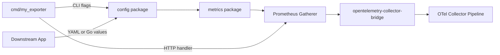

# Embeddable Prometheus Exporters

This guide is for Prometheus exporter maintainers who want their exporter to run as a native receiver in the Prometheus OpenTelemetry Collector distribution.

The exporter does not need to be rewritten as an OpenTelemetry component. Instead, it should expose reusable Go APIs for configuration and metric generation. The standalone binary can still read CLI flags and serve `/metrics`; downstream callers can build the same config from other inputs and consume metrics through a Prometheus registry or gatherer.

## Design Model

An embeddable exporter separates three responsibilities:

- `cmd/my_exporter`: CLI flags, environment variables, HTTP server setup, `/metrics`, web configuration, and process-level logging.
- `config`: user-facing configuration, defaults, validation, and conversion to lower-level runtime options.
- `metrics`: metric generation through a Prometheus registry or gatherer, without assuming HTTP.

A good default layout looks like this:

```text
.
├── cmd/
│   └── my_exporter/
│       └── main.go
├── config/
│   └── config.go
└── metrics/
    └── registry.go
```

Reusable packages should not depend on binary-specific or collector-specific concerns. Keep CLI flags, HTTP handlers, environment parsing, mapstructure metadata, and OpenTelemetry receiver settings outside `config` and `metrics`.

### Config Package Contract

The config package must declare the exporter's complete user-facing configuration surface. If a user can tune behavior through the exporter binary, that knob should have a home in `config.Config`.

```go
package config

import "time"

type Config struct {
    DataSourceName    string
    MetricPrefix      string
    CollectionTimeout time.Duration
}
```

The config package must also provide defaults. This gives every caller the same defaults.

```go
package config

import "time"

const (
    DefaultMetricPrefix      = "my_exporter"
    DefaultCollectionTimeout = 10 * time.Second
)

func NewConfigWithDefaults() Config {
    return Config{
        MetricPrefix:      DefaultMetricPrefix,
        CollectionTimeout: DefaultCollectionTimeout,
    }
}
```

Finally, the config package must validate constructed configs. The command package should not be the only place that knows what valid configuration means.

```go
package config

import "fmt"

func (c Config) Validate() error {
    if c.MetricPrefix == "" {
        return fmt.Errorf("metric prefix must not be empty")
    }
    if c.DataSourceName == "" {
        return fmt.Errorf("data source name must not be empty")
    }
    if c.CollectionTimeout <= 0 {
        return fmt.Errorf("collection timeout must be greater than zero")
    }
    return nil
}
```

With this shape, the command package becomes a thin adapter from CLI flags into `config.Config`.

```go
cfg := config.NewConfigWithDefaults()
cfg.DataSourceName = *dataSourceName
cfg.MetricPrefix = *metricPrefix
cfg.CollectionTimeout = *collectionTimeout

if err := cfg.Validate(); err != nil {
    return err
}
```

### Metrics Package Contract

The metrics package must provide an API that generates metrics from `config.Config`. In `client_golang`, a `prometheus.Registry` implements `prometheus.Registerer`, `prometheus.Gatherer`, and `prometheus.Collector`. `promhttp.HandlerFor` accepts a `prometheus.Gatherer`, so callers do not always need an API that only registers collectors. They need an API that gives them something gatherable, or an API that lets them populate a gatherable registry they already own.

There are at least two patterns we need to document carefully:

- Registry-backed collectors: the exporter manages a long-lived registry that is periodically scraped.
- Request-based gathering: The `Gather` request triggers metric collection.

TODO: Add concrete examples for both metrics package patterns. The examples should follow `client_golang` terminology closely and show how `cmd/my_exporter` wires `promhttp.HandlerFor` without leaking HTTP details into the reusable metrics package.

Like the config package, the metrics package should stay focused on exporter behavior. Pass the exporter config and normal dependencies such as a logger, clients, a Prometheus registerer, or a request model owned by the exporter. Do not pass `http.ResponseWriter`, `*http.Request`, collector receiver settings, or CLI flag values into this package.



The `opentelemetry-collector-bridge` package adapts this shape into OpenTelemetry Collector receiver interfaces. It starts the exporter lifecycle, gathers from the returned Prometheus registry on an interval, converts metrics, and forwards them to the next collector consumer. The current bridge API expects a registry, but the reusable exporter package can still expose a gatherer-oriented API and adapt it to a registry-backed receiver where needed.

The `prometheus-opentelemetry-collector` repository wires these receivers into an OCB-built distribution. It is also where dependency conflicts and generated collector build failures should be caught continuously as more exporters become embeddable.

## Anti-patterns and Preferred Designs

### CLI Flags as the Only Configuration API

Avoid making package-level CLI flags the only way to configure exporter behavior. That couples the exporter logic to one binary entrypoint and forces downstream users to reimplement or reach into flag state.

Bad:

```go
var (
    dataSourceName = kingpin.Flag("data-source-name", "Postgres DSN").String()
    metricPrefix   = kingpin.Flag("metric-prefix", "Metric prefix").Default("pg").String()
)

func NewCollector() (*Collector, error) {
    return newCollector(*dataSourceName, *metricPrefix)
}
```

Good:

```go
package config

type Config struct {
    DataSourceNames []string
    MetricPrefix    string
}

func NewConfigWithDefaults() Config {
    return Config{MetricPrefix: "pg"}
}

func (c Config) Validate() error {
    if c.MetricPrefix == "" {
        return fmt.Errorf("metric prefix must not be empty")
    }
    return nil
}
```

The binary can still use flags, but flags should construct the reusable configuration.

```go
cfg := config.NewConfigWithDefaults()
cfg.DataSourceNames = *dataSourceNames
cfg.MetricPrefix = *metricPrefix
```

### HTTP Handler as the Only Metrics Entrypoint

Avoid hiding metric generation behind an HTTP handler as the only public API. `promhttp.HandlerFor` accepts a `prometheus.Gatherer`, so the reusable boundary should be the gatherer or registry, not the HTTP handler itself.

Bad:

```go
func MetricsHandler(w http.ResponseWriter, r *http.Request) {
    registry := prometheus.NewRegistry()
    registry.MustRegister(NewCollectorFromRequest(r))
    promhttp.HandlerFor(registry, promhttp.HandlerOpts{}).ServeHTTP(w, r)
}
```

This makes the HTTP handler the only reusable entrypoint. A collector receiver has to duplicate request handling or scrape the HTTP endpoint instead of gathering directly. The problem is not doing work during collection; that is normal for exporters such as Postgres. The problem is making `http.ResponseWriter` and `*http.Request` part of the reusable metrics API.

TODO: Add good examples for both long-lived registry exporters and request-triggered probe exporters once we settle on the recommended metrics package API shape.

### Global Prometheus Registration in Reusable Packages

Avoid registering reusable package metrics with `promauto` or `prometheus.DefaultRegisterer`. Global registration makes multiple embedded instances collide and makes tests harder to isolate.

Bad:

```go
var reloads = promauto.NewCounter(prometheus.CounterOpts{
    Name: "exporter_config_reloads_total",
    Help: "Total number of config reloads.",
})
```

Good:

```go
type ReloadMetrics struct {
    reloads prometheus.Counter
}

func NewReloadMetrics(registerer prometheus.Registerer) (*ReloadMetrics, error) {
    reloads := prometheus.NewCounter(prometheus.CounterOpts{
        Name: "exporter_config_reloads_total",
        Help: "Total number of config reloads.",
    })
    if err := registerer.Register(reloads); err != nil {
        return nil, err
    }
    return &ReloadMetrics{reloads: reloads}, nil
}
```

The standalone binary can pass `prometheus.DefaultRegisterer`. Embedded callers can pass a scoped registry.

### Duplicated Collector and Exporter Config

Avoid maintaining separate, manually mapped configuration models without drift tests. Every upstream config field that the receiver decodes manually becomes a chance for the exporter binary and the embedded receiver to behave differently.

Bad:

```go
// In the exporter repository.
type Config struct {
    MetricPrefix string
    Timeout      time.Duration
}

// In the collector receiver repository.
type CollectorConfig struct {
    MetricPrefix string `mapstructure:"metric_prefix"`
}

func decodeConfig(raw map[string]interface{}) (config.Config, error) {
    cfg := config.NewConfigWithDefaults()
    if value, ok := raw["metric_prefix"]; ok {
        cfg.MetricPrefix = value.(string)
    }
    return cfg, nil
}
```

This receiver silently forgets `Timeout`. The exporter can support a new config field while the collector receiver keeps ignoring it.

The collector receiver may know how collector YAML maps into the upstream exporter config, but the exporter config package should not need OTel-specific fields, tags, or option metadata just to support that receiver.

If the receiver must decode fields manually, keep a decoder table in the receiver module and add a reflection-based test that fails when the upstream exporter config changes without a matching receiver update.

```go
func TestConfigDecoderCoversAllExporterConfigFields(t *testing.T) {
    configType := reflect.TypeOf(config.Config{})
    for i := 0; i < configType.NumField(); i++ {
        field := configType.Field(i)
        if field.PkgPath != "" {
            continue
        }
        if _, ok := configFieldDecoders[field.Name]; !ok {
            t.Fatalf("exporter config field %s is not covered by the receiver decoder", field.Name)
        }
    }

    for fieldName := range configFieldDecoders {
        if _, ok := configType.FieldByName(fieldName); !ok {
            t.Fatalf("receiver decoder covers unknown exporter config field %s", fieldName)
        }
    }
}
```

### Standalone Binary Assumptions in Lifecycle

Avoid creating independent loggers, relying on process-global state, or leaking resources. In a collector, the exporter is one component among many and should use caller-provided lifecycle inputs.

Bad:

```go
func StartExporter(cfg config.Config) (*prometheus.Registry, error) {
    logger := slog.Default()
    registry := prometheus.NewRegistry()
    registry.MustRegister(NewCollector(cfg, logger))
    return registry, nil
}
```

Good:

```go
type lifecycleManager struct {
    closer io.Closer
}

func (m *lifecycleManager) Start(
    _ context.Context,
    set receiver.Settings,
    exporterConfig prombridge.Config,
) (*prometheus.Registry, error) {
    cfg, ok := exporterConfig.(*Config)
    if !ok {
        return nil, fmt.Errorf("invalid config type: %T", exporterConfig)
    }
    logger := slog.New(zapslog.NewHandler(set.Logger.Core()))
    registry, collectorSet, err := postgresmetrics.NewRegistry(cfg.Config, logger)
    if err != nil {
        return nil, err
    }
    m.closer = collectorSet
    return registry, nil
}

func (m *lifecycleManager) Shutdown(context.Context) error {
    if m.closer == nil {
        return nil
    }
    return m.closer.Close()
}
```

## Implementation Checklist

When making an exporter embeddable, aim for this order:

1. Move user-provided configuration into an exporter-owned config package.
2. Keep CLI flags in the binary, but make them populate the config package.
3. Move metric generation behind an API that returns a `prometheus.Gatherer`, returns a registry, or populates a caller-owned registry.
4. Remove global registration from reusable packages, or accept a caller-provided registerer.
5. Add drift tests for defaults, field names, and runtime mappings.
6. Add a collector receiver module that adapts the exporter package through `opentelemetry-collector-bridge`.
7. Add the receiver to `builder-config.yaml` and run the collector distribution build.

Reference work includes Stackdriver config sharing, Postgres global metric registration cleanup, YACE standalone config and registry APIs, and the Stackdriver, YACE, and Postgres receiver modules in this repository.
