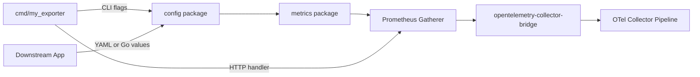

# Embeddable Prometheus Exporters

This guide is for Prometheus exporter maintainers who want their exporter to run as a native receiver in the Prometheus OpenTelemetry Collector distribution.

The exporter does not need to be rewritten as an OpenTelemetry component. Instead, it should expose reusable Go APIs for configuration and metric generation. The standalone binary can still read CLI flags and serve `/metrics`; downstream callers can build the same config from other inputs and consume metrics through a Prometheus registry or gatherer.

## Design Model

An embeddable exporter separates three responsibilities:

- `cmd/my_exporter`: CLI flags, environment variables, HTTP server setup, `/metrics`, web configuration, and process-level logging.
- `config`: User-facing configuration, defaults, validation, and conversion to lower-level runtime options.
- `collectors`: Implementation of Prometheus client_golang's Collector interface, while receiving an instance of Config for customization.

A good default layout looks like this:

```text
.
├── cmd/
│   └── my_exporter/
│       └── main.go
├── config/
│   └── config.go
└── collectors/
    └── runtime.go
    └── metrics.go
```

Of course, the layout don't need to be exactly the same as above, but the example shows the intended separation of concerns. For the Prometheus exporter implementation, the `cmd/my_exporter` package will be responsible for wiring the config and the collectors package with other parts of the system, like kingpin flags, environment variable parsing, serving metrics in a `/metrics` endpoints, etc. In this repository, or any repository, which implements the OpenTelemetry Collector interfaces, the Config and Collectors packages can be consumed without getting interference from the exporter's CLI logic.

### Config Package Contract

The config package must declare the exporter's complete user-facing configuration surface. If a user can tune behavior through the exporter binary, that knob should have a home in `config.Config`.

```go
package config

import "time"

type Config struct {
    DataSourceName    string
    MetricPrefix      string
    CollectionTimeout time.Duration
}
```

The config package must also provide defaults. This gives every caller the same defaults.

```go
package config

import "time"

const (
    DefaultMetricPrefix      = "my_exporter"
    DefaultCollectionTimeout = 10 * time.Second
)

func NewConfigWithDefaults() Config {
    return Config{
        MetricPrefix:      DefaultMetricPrefix,
        CollectionTimeout: DefaultCollectionTimeout,
    }
}
```

Finally, the config package must validate constructed configs.

```go
package config

import "fmt"

func (c Config) Validate() error {
    if c.MetricPrefix == "" {
        return fmt.Errorf("metric prefix must not be empty")
    }
    if c.DataSourceName == "" {
        return fmt.Errorf("data source name must not be empty")
    }
    if c.CollectionTimeout <= 0 {
        return fmt.Errorf("collection timeout must be greater than zero")
    }
    return nil
}
```

With this shape, the command package becomes a thin adapter from CLI flags into `config.Config`. Similarly, the OTel Collector implementation can stay in sync with the exporter for config creation and validation.

```go
cfg := config.NewConfigWithDefaults()
cfg.DataSourceName = *dataSourceName // *dataSourceName can come from kingpin, YAML decoding or any other config strategy.

if err := cfg.Validate(); err != nil {
    return err
}
```

### Collectors Package Contract

The metrics package must provide an API that generates metrics from `config.Config`. In `client_golang`, a `prometheus.Registry` implements `prometheus.Registerer`, `prometheus.Gatherer`, and `prometheus.Collector`. `promhttp.HandlerFor` accepts a `prometheus.Gatherer`, so callers do not always need an API that only registers collectors. They need an API that gives them something gatherable, or an API that lets them populate a gatherable registry they already own.

There are at least two patterns we need to document carefully:

- Registry-backed collectors: the exporter manages a long-lived registry that is periodically scraped.
- Request-based gathering: The `Gather` request triggers metric collection.

TODO: Add concrete examples for both metrics package patterns. The examples should follow `client_golang` terminology closely and show how `cmd/my_exporter` wires `promhttp.HandlerFor` without leaking HTTP details into the reusable metrics package.

Like the config package, the metrics package should stay focused on exporter behavior. Pass the exporter config and normal dependencies such as a logger, clients, a Prometheus registerer, or a request model owned by the exporter. Do not pass `http.ResponseWriter`, `*http.Request`, collector receiver settings, or CLI flag values into this package.



The `opentelemetry-collector-bridge` package adapts this shape into OpenTelemetry Collector receiver interfaces. It starts the exporter lifecycle, gathers from the returned Prometheus registry on an interval, converts metrics, and forwards them to the next collector consumer. The current bridge API expects a registry, but the reusable exporter package can still expose a gatherer-oriented API and adapt it to a registry-backed receiver where needed.

The `prometheus-opentelemetry-collector` repository wires these receivers into an OCB-built distribution. It is also where dependency conflicts and generated collector build failures should be caught continuously as more exporters become embeddable.

## Anti-patterns and Preferred Designs

### Leaking CLI logic into downstream packages

Avoid passing parsed CLI flags directly into Collector constructors. Build a Config struct and validate it before constructing the Collector.

Bad:

```go
var (
    dataSourceName = kingpin.Flag("data-source-name", "Postgres DSN").String()
    metricPrefix   = kingpin.Flag("metric-prefix", "Metric prefix").Default("pg").String()
)

func NewCollector() (*Collector, error) {
    return newCollector(*dataSourceName, *metricPrefix)
}
```

Good:

```go
package config

type Config struct {
    DataSourceNames []string
    MetricPrefix    string
}

func NewConfigWithDefaults() Config {
    return Config{MetricPrefix: "pg"}
}

func (c Config) Validate() error {
    if c.MetricPrefix == "" {
        return fmt.Errorf("metric prefix must not be empty")
    }
    return nil
}
```

The binary can still use flags, but flags should construct the reusable configuration.

```go
var dataSourceNames = kingpin.Flag("data-source-name", "Postgres DSN").
    Required().
    Strings()

_, err := kingpin.Parse(os.Args[1:])
if err != nil {
    return err
}

cfg := config.NewConfigWithDefaults()
cfg.DataSourceNames = *dataSourceNames
if err := cfg.Validate(); err != nil {
    return err
}

c := collectors.NewCollector(cfg)
```

### HTTP Handler as the Only Metrics Entrypoint

Avoid hiding metric generation behind an HTTP handler as the only public API. `promhttp.HandlerFor` accepts a `prometheus.Gatherer`, so the reusable boundary should be the gatherer or registry, not the HTTP handler itself.

Bad:

```go
func MetricsHandler(w http.ResponseWriter, r *http.Request) {
    registry := prometheus.NewRegistry()
    registry.MustRegister(NewCollector(r))
    promhttp.HandlerFor(registry, promhttp.HandlerOpts{}).ServeHTTP(w, r)
}
```

Good:

```go
// package collectors
type Runtime struct {
    // exporter clients, config, logger, caches, etc.
}

func NewRuntime(cfg config.Config, logger *slog.Logger) (*Runtime, error) {
    // Resolve exporter dependencies here.
}

func (r *Runtime) Collectors() ([]prometheus.Collector, error) {
    // Build collectors from exporter config and dependencies.
}

// cmd/my_exporter
func MetricsHandler(runtime *collectors.Runtime, logger *slog.Logger) (http.Handler, error) {
    registry := prometheus.NewRegistry()

    cs, err := runtime.Collectors()
    if err != nil {
        return nil, err
    }
    for _, c := range cs {
        if err := registry.Register(c); err != nil {
            return nil, err
        }
    }

    opts := promhttp.HandlerOpts{
        ErrorLog: slog.NewLogLogger(logger.Handler(), slog.LevelError),
    }
    return promhttp.HandlerFor(registry, opts), nil
}
```

The bad example makes the HTTP handler the only reusable entrypoint. A collector receiver has to duplicate request handling or scrape the HTTP endpoint instead of gathering directly. The good example keeps collector construction in the reusable package and lets the binary adapt that collector set to HTTP with `promhttp.HandlerFor`.

### Global and Package Variables

Avoid declaring metrics as package variables and/or pre-registering them in the global `prometheus.DefaultRegisterer`. Remember that, while in the CLI there's only one instance of an exporter running, if the exporter is embedded as a Go library, it is very likely that multiple instances of the same exporter are running. Global and package variables create shared metric state and registration collisions in this case.

Add a typed struct to your runtime, and create the metrics during Runtime initialization.

Bad:

```go
var reloads = promauto.NewCounter(prometheus.CounterOpts{
    Name: "exporter_config_reloads_total",
    Help: "Total number of config reloads.",
})

type Runtime struct{}

func (r *Runtime) ReloadConfig() {
    reloads.Inc()
}
```

Bad:

```go
type Runtime struct {
    reloads prometheus.Counter
}

func NewRuntime() *Runtime {
    reloads := prometheus.NewCounter(prometheus.CounterOpts{
        Name: "exporter_config_reloads_total",
        Help: "Total number of config reloads.",
    })
    prometheus.MustRegister(reloads)
    return &Runtime{reloads: reloads}
}

runtimeA := NewRuntime()
runtimeB := NewRuntime()
// Two instances sharing the same prometheus.Registry.
```

Good:

```go
type Runtime struct {
    metrics *Metrics
}

type Metrics struct {
    reloads prometheus.Counter
}

func NewRuntime() (*Runtime, error) {
    return &Runtime{
        metrics: newMetrics(),
    }, nil
}

func newMetrics() *Metrics {
    reloads := prometheus.NewCounter(prometheus.CounterOpts{
        Name: "exporter_config_reloads_total",
        Help: "Total number of config reloads.",
    })
    return &Metrics{reloads: reloads}
}

func (r *Runtime) Collectors() ([]prometheus.Collector, error) {
    return []prometheus.Collector{
        r.metrics.reloads,
    }, nil
}

func (r *Runtime) ReloadConfig() {
    r.metrics.reloads.Inc()
}
```

In `cmd/my_exporter`, one can register the collectors with `prometheus.DefaultRegisterer` or a fresh registry. Embedded callers can register the same collectors with a scoped registry.